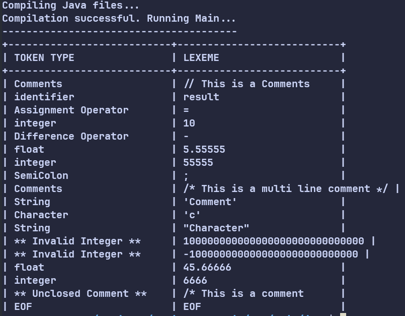
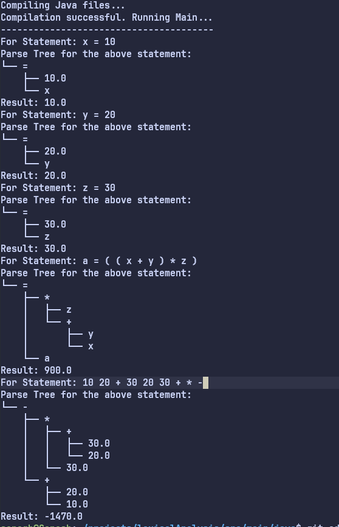

# Lexical Analysis

A simple Implementation of lexical analysis in java. Given statements in a file. Goes through it, gets the lexemes, analyzes them, tokenizes them and outputs the final token and respective lexemes. 

## Implementation

The code uses java as the main language. Any external libraries and exceptions that make the checking easy are not used. External libraries used include Arraylist, IO exception and file handling for reading.

## Use Cases

Given a file, The program reads through the characters and defines a token for the lexeme. The design explores all possibilities given a character and processes that lexeme and moves on to the other.

### Tokens Implementation

- Integer: **32** bit Integer
- Float: With a max of **5** digits after decimal
- Identifier: Given the lexeme is neither a keyword or invalid name it includes it as a Identifier
- keyword: Looks in the presented look up table, and checks if a valid identifier is keyword
- Strings: Any characters inside Double Quote or Single Quote (exception single quote : not of length 1)
- Character: Enclosed with single quotes and has length neither
- Comments: Single and multi line comments are recognized, Single line (/) and multi line (/* and */).
- Unknown: Any other inputs that do not qualify to any of the above gets classified into Unknown
- EOF: declares the end of file

#### Keywords recognized
| Keywords |
| --- |
| if , else, for ,int ,float ,double ,do ,while ,char ,String |
| --- |

## Sample 

This program currently just takes the following examples of inputs.
### Input
<!-- ``` -->
<!-- // This is a Comments -->
<!-- result = 10 - 5.55555055555; -->
<!-- /* This -->
<!-- is -->
<!-- a multi -->
<!-- line -->
<!-- comment */ -->
<!-- 'Comment' -->
<!-- 'c' -->
<!-- "Character" -->
<!-- 100000000000000000000000000000 -->
<!-- -1000000000000000000000000000 -->
<!-- 45.6666666666 -->
<!-- /* This is a comment -->
<!-- ``` -->
<!---->

```
 
x = 10;
y = 20;
z = 30;

a = ((x+y)*z);

10 + 20 - 30 * (20 + 30);

```

### Output 

<!--  -->

